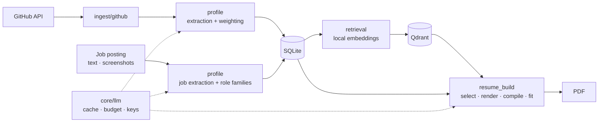

<div align="center">

# Open to Work

**A self-hosted job search workspace that turns your GitHub into evidence-backed, tailored resumes.**

[](https://github.com/ShailKPatel/Open-to-work/actions/workflows/ci.yml)


[](LICENSE)

<a href="#tech-stack"></a>

[Features](#what-it-does) · [Quick start](#quick-start) · [How it works](#how-it-works) · [Tech stack](#tech-stack) · [Development](#development) · [Limitations](#limitations)

</div>

---

## Why

Most resume tools let a language model write whatever sounds good. Open to Work does the opposite: every skill in your profile points back to **real evidence** (a dependency manifest, a README, a role you held), and the resume generator is only allowed to pick from that evidence. If the model returns a project or skill that was not a candidate, it is thrown away.

## What it does

<table>
<tr>
<td width="33%" valign="top">

### Profile
- Sync any GitHub user or repo
- Skills from manifests (Python, JS, Go, Rust, Ruby, JVM) with **no LLM**
- Evidence weighted by recency, volume, and fork status
- Interactive **skill map** built from embeddings
- Import existing PDF or image resumes

</td>
<td width="33%" valign="top">

### Jobs
- Add postings by **pasted text or screenshots**
- Extracts salary, seniority, and required skills
- Groups similar titles into role families
- Skill gap per posting
- Demand analytics across all postings

</td>
<td width="33%" valign="top">

### Resumes
- Tailored to one posting via semantic search
- LaTeX output, one or two pages
- **Auto page fit**: trims one item at a time until it fits
- Revise with a plain-language instruction
- Every version saved to a library

</td>
</tr>
</table>

## Quick start

> [!TIP]
> The only requirement is Docker with Compose v2.1 or newer. Nothing needs to be configured before the first run.

| OS | Before the first run |
|---|---|
| Linux | Nothing. `make start` installs Docker if missing (Ubuntu, Debian, Fedora, CentOS, RHEL). On other distros, install Docker yourself first. |
| macOS | Install and open [Docker Desktop](https://www.docker.com/products/docker-desktop/). |
| Windows | Install [Docker Desktop](https://www.docker.com/products/docker-desktop/), then double-click `start.cmd` in the cloned folder (it uses ports 8000 and 6333). Or run the commands below from a WSL terminal, which also picks free ports. |

```bash
git clone https://github.com/ShailKPatel/Open-to-work.git open-to-work
cd open-to-work
make start
```

Then:

1. Create a profile.
2. Paste an LLM API key when prompted (free Gemini keys: [Google AI Studio](https://aistudio.google.com/apikey)).
3. Sync a GitHub account and pick a job posting to build a resume for.

No `make` on your system? Run `./start.sh` instead; it does the same thing. If Docker is missing on macOS or Windows, the script opens the Docker Desktop install page for your OS. The first build downloads a few GB and takes several minutes.

<details>
<summary><b>What <code>make start</code> does</b></summary>

<br>

- Installs Docker on Linux if it is missing
- Builds and starts the app and Qdrant containers
- Waits for the health check, then opens your browser
- Uses port `8000` (app) and `6333` (Qdrant), or the next free port if either is taken

`docker compose up --build` also works, but only on the default ports.

</details>

## How it works



<details>
<summary><b>Skill extraction</b></summary>

<br>

- Dependencies are parsed straight from manifests, with no model involved.
- One LLM call reads the README (or the repo description if there is none). Repos with neither cost nothing.
- Evidence for the same skill across repos is combined with a **noisy-OR**, weighted by source type, fork status, commit recency, and commit volume.
- Only repos pushed since the last sync are refetched. A rate limit mid-sync keeps everything already fetched.

</details>

<details>
<summary><b>Resume generation</b></summary>

<br>

1. Semantic search retrieves candidate projects, skills, and experience bullets for the posting.
2. One LLM call picks from those candidates and writes the summary and project bullets.
3. Anything returned that was not a candidate is discarded. Work history and education are never edited by the model.
4. The result is rendered from a Jinja2 LaTeX template and compiled with Tectonic.
5. If it overflows, a multimodal pass reads the PDF and removes one item at a time (a skill, then a project bullet, then an experience bullet) until it fits.

</details>

<details>
<summary><b>LLM gateway</b></summary>

<br>

Every model call goes through a single client that:

- Caches responses by content hash
- Checks the monthly budget **before** sending a request
- Records cost, tokens, latency, and which feature made the call
- Fails over between keys for the same provider mid-job, so long jobs continue instead of restarting

</details>

## Tech stack

| Layer | Tools |
| --- | --- |
| **Backend** |     |
| **Retrieval** |    |
| **LLM** |       |
| **Frontend** |    |
| **Documents** |   |
| **Quality** |     |
| **Runtime** |  |

Embeddings run locally. Also supports Azure OpenAI and AWS Bedrock through LiteLLM.

## Configuration

Settings live in the app, not in files. Open **Manage APIs** (`/apis`):

| Setting | Default | Purpose |
| --- | --- | --- |
| Provider keys | none | Encrypted at rest. Multiple keys per provider act as failover. |
| Bulk model | `gemini/gemini-flash-lite-latest` | Per-repo extraction, role families, groundedness checks |
| Quality model | `gemini/gemini-flash-latest` | Resume generation, page fitting, job and resume extraction |
| Monthly budget | `$20` | Hard cap across all LLM calls |

Any [LiteLLM model name](https://docs.litellm.ai/docs/providers) works, for example `ollama/llama3.1`.

> [!NOTE]
> The only file-based setting is optional: `GITHUB_TOKEN` in `.env` raises the GitHub API limit from 60 to 5,000 requests per hour.

All data (SQLite database, uploads, backups, and the encryption key) lives in `./data`. The database is snapshotted on every startup and the last 10 snapshots are kept.

## Development

```bash
python3 -m venv .venv
.venv/bin/pip install -e ".[dev]"
docker compose up -d qdrant
```

| Command | What it does |
| --- | --- |
| `make test` | Unit tests. No network or API key needed. |
| `make coverage` | Unit tests with line and branch coverage (fails under 90%) |
| `make lint` | ruff and mypy |
| `make test-live` | Opt-in checks against real services |
| `make ingest ACCOUNT=<user>` | GitHub sync from the command line |
| `make eval ACCOUNT=<id>` | Retrieval and groundedness evaluation |

<details>
<summary><b>Testing</b></summary>

<br>

**`tests/unit/`** covers every layer in isolation, with temporary SQLite databases, in-memory Qdrant, and fakes for GitHub, the LLM, embeddings, and Tectonic. Every API router is exercised, and a route sweep renders every page.

**`tests/live/`** talks to real services and only runs suites whose variable is set:

| Variable | Checks |
| --- | --- |
| `LIVE_LLM_API_KEY` | Text, image, PDF, and multi-turn calls through the gateway (billed) |
| `LIVE_GITHUB=1` | API reachability, auth, 404 handling, single-repo sync |
| `LIVE_APP_URL` | Health, every page, and JSON endpoints on a running instance |

</details>

<details>
<summary><b>Evaluation</b></summary>

<br>

`make eval` scores retrieval against a hand-labeled golden set:

- Dense retrieval vs. a BM25 baseline (precision@5, recall@10)
- Context precision over the top 10
- LLM-judged groundedness of generated bullets

Label your own set with `python -m scripts.label_golden_set --account <id>`. CI runs the same eval on a synthetic fixture and fails if retrieval drops below the committed baseline.

</details>

<details>
<summary><b>Project layout</b></summary>

<br>

```
app/
  api/            FastAPI routers and page routes
  core/           settings, models, LLM client, embeddings, credential storage
  ingest/github/  GitHub client, sync, manifest parsing, cancellation
  profile/        skill extraction and weighting, resume and job extraction
  retrieval/      Qdrant indexing and search
  resume_build/   resume assembly, LaTeX templates, compilation, page fitting
  evals/          golden set, BM25 baseline, metrics, groundedness
  web/templates/  Jinja2 pages
scripts/          golden-set labeling, eval gate, embedding benchmark, maintenance
tests/            unit and live suites
```

More detail in [docs/ARCHITECTURE.md](docs/ARCHITECTURE.md).

</details>

## Privacy

> [!IMPORTANT]
> Everything is stored and embedded locally. Only this text is sent to your chosen LLM provider: README and description text, job posting text and screenshots, uploaded resumes, and the profile content used to build a resume. Job posting text is always sent as a separate user message, never inside a system prompt.

## Limitations

- Source files are not scanned for imports; evidence comes from manifests, READMEs, commits, and manual entries.
- Job postings are added one at a time from pasted text or screenshots. Links are stored, not fetched, and there is no job-board crawler.
- The golden set is empty on a fresh checkout, so eval numbers only mean something after you label your own data.
- Editing a skill or job title does not re-index it until its parent is reprocessed.
- Resume import supports PDF and images only.
- Icon glyphs in compiled PDFs do not copy as readable text.

## License

[MIT](LICENSE)
