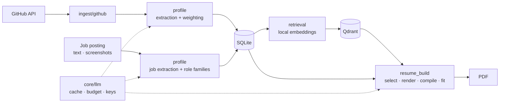

# Open to Work

[](https://github.com/ShailKPatel/Open-to-work/actions/workflows/ci.yml)
[](LICENSE)

Open to Work turns your GitHub into resumes built for each job. Every skill on the page is backed by real work: a dependency file, a README, a role you held. It runs on your own machine.

## Why

A resume should prove what it claims. Here the model picks from your evidence and writes around it. It cannot add a project or skill you do not have. Anything it returns outside the candidate list is thrown out.

## What it does

**Profile**

- Syncs any GitHub user or repository.
- Reads skills straight from dependency manifests (Python, JavaScript, Go, Rust, Ruby, JVM). No LLM.
- Weights evidence by recency, volume, and fork status.
- Draws a skill map from embeddings.
- Imports your existing resume from a PDF or image.

**Jobs**

- Add a posting by pasting text or dropping in screenshots.
- Pulls out salary, seniority, and required skills.
- Groups similar titles into role families.
- Shows your skill gap for each posting and skill demand across all of them.

**Resumes**

- Tailors to one posting with semantic search.
- Builds LaTeX, one page or two.
- Fits the page: tightens the layout first, then cuts one item at a time.
- Revises from a plain instruction.
- Keeps every version in a library.

## Quick start

You need Docker with Compose v2.1 or newer. Nothing else.

```bash
git clone https://github.com/ShailKPatel/Open-to-work.git open-to-work
cd open-to-work
make start
```

Then create a profile, paste an LLM API key (free Gemini keys at [Google AI Studio](https://aistudio.google.com/apikey)), sync a GitHub account, and pick a posting.

- **Linux:** `make start` installs Docker if it is missing on Ubuntu, Debian, Fedora, CentOS, and RHEL. On other distros, install Docker first.
- **macOS:** install and open [Docker Desktop](https://www.docker.com/products/docker-desktop/).
- **Windows:** install [Docker Desktop](https://www.docker.com/products/docker-desktop/), then double-click `start.cmd`. It uses port 8000. From a WSL terminal, the commands above work and pick a free port.

No `make`? Run `./start.sh`. If Docker is missing on macOS or Windows, the script opens the install page.

`make start` builds the app and Qdrant containers, waits for the health check, and opens your browser. The app takes port 8000, or the next free port. Qdrant is reachable only from the app container.

## How it works



### Skill extraction

- Dependencies come straight from manifests. No model.
- One LLM call reads each README, or the repo description when there is no README. Repos with neither are skipped.
- Evidence is weighted by source, fork status, commit recency, and commit volume. Relevance to the job picks the skills and projects. Weight sets their order and breaks near-ties.
- A sync refetches only repos pushed since the last one. A rate limit midway keeps everything fetched so far.

### Resume generation

1. Hybrid search finds candidate projects, skills, and experience bullets for the posting: one query for the role and one per required skill, each run as both embedding search and keyword (BM25) search, merged by reciprocal rank fusion. It searches with the posting's extracted title, summary, and skills rather than the raw text.
2. One LLM call picks from those candidates and writes the summary and project bullets.
3. Anything not on the candidate list is dropped. Work history and education come straight from your profile.
4. A Jinja2 LaTeX template renders the result and Tectonic compiles it.
5. If the PDF runs long, a multimodal model reads it and cuts one item at a time (a skill, then a project bullet, then an experience bullet) until it fits.

### LLM gateway

Every model call goes through one client. It caches responses by content hash, checks the monthly budget before sending, and records cost, tokens, latency, and the feature that made the call. When a key runs out, the next key for the same provider takes over and the job keeps going.

## Tech stack

| Layer | Tools |
| --- | --- |
| Backend | Python 3.12, FastAPI, SQLAlchemy, SQLite |
| Retrieval | Qdrant, bge-base-en-v1.5 (local embeddings), rank-bm25 |
| LLM | LiteLLM with Gemini, OpenAI, Anthropic, Mistral, Ollama, Azure OpenAI, AWS Bedrock |
| Frontend | Jinja2, Tailwind CSS, Alpine.js |
| Documents | Tectonic (LaTeX), pypdf |
| Quality | pytest, Ruff, mypy, GitHub Actions |
| Runtime | Docker Compose |

## Configuration

Settings live in the app. Open **Manage APIs** (`/apis`).

| Setting | Default | Purpose |
| --- | --- | --- |
| Provider keys | none | Encrypted at rest. Extra keys for a provider act as failover. |
| Bulk model | `gemini/gemini-flash-lite-latest` | Per-repo extraction, role families, groundedness checks |
| Quality model | `gemini/gemini-flash-latest` | Resume generation, page fitting, job and resume extraction |
| Monthly budget | `$20` | Hard cap across all LLM calls |

Any [LiteLLM model name](https://docs.litellm.ai/docs/providers) works, for example `ollama/llama3.1`.

One setting lives in a file, and it is optional: `GITHUB_TOKEN` in `.env` raises the GitHub API limit from 60 to 5,000 requests per hour.

All data lives in `./data`: the SQLite database, uploads, backups, and the encryption key. Each startup snapshots the database and keeps the last 10.

## Privacy

Your data and embeddings stay on your machine. Your LLM provider sees only README and description text, job posting text and screenshots, uploaded resumes, and the profile content used to build a resume. The pages load nothing from a CDN except Google Fonts. Tailwind is compiled and the JS libraries are pinned, checksum-verified and served by the app.

## Development

```bash
python3 -m venv .venv
.venv/bin/pip install -e ".[dev]"
docker compose -f docker-compose.yml -f docker-compose.dev.yml up -d qdrant
```

| Command | What it does |
| --- | --- |
| `make test` | Unit tests. No network or API key needed. |
| `make coverage` | Unit tests with line and branch coverage. Fails under 90%. |
| `make lint` | Ruff and mypy |
| `make test-live` | Checks against real services |
| `make ingest ACCOUNT=<user>` | GitHub sync from the command line |
| `make eval ACCOUNT=<id>` | Retrieval and groundedness evaluation |

### Testing

`tests/unit/` tests each layer on its own, with temporary SQLite databases, in-memory Qdrant, and fakes for GitHub, the LLM, embeddings, and Tectonic.

`tests/live/` hits real services. Each suite runs only when its variable is set:

| Variable | Checks |
| --- | --- |
| `LIVE_LLM_API_KEY` | Text, image, PDF, and multi-turn calls through the gateway (billed) |
| `LIVE_GITHUB=1` | API reachability, auth, 404 handling, single-repo sync |
| `LIVE_APP_URL` | Health, every page, and JSON endpoints on a running instance |

### Evaluation

The app has no users or production traffic to learn from, so it is evaluated on two purpose-built sets. Neither contains anyone's real profile.

| Set | What is in it | Labels |
| --- | --- | --- |
| Real-text (`evals/real/`) | 28 public job postings from 14 employers' job boards, 21 pinned open-source repositories as one portfolio | Hand-labeled against written criteria |
| Synthetic (`evals/synthetic/`) | 10 invented profiles (new grad to manager, six countries), 29 postings, 45 labeled resume bullets, 25 prompt injection postings | Rule-labeled; bullets and attacks by hand |

[`evals/real/DATA_SOURCES.md`](evals/real/DATA_SOURCES.md) covers sources, privacy, and limits. Posting and README text is downloaded on first run and never committed.

**Retrieval** (2026-10-08, real-text set, 26 queries, 95% bootstrap intervals):

| System | precision@5 | nDCG@10 | MRR |
| --- | --- | --- | --- |
| Hybrid search (what the app runs) | **0.800** [0.69, 0.89] | **0.703** [0.61, 0.79] | **0.918** [0.82, 1.00] |
| Single-query embedding search (previous) | 0.515 [0.43, 0.61] | 0.481 [0.40, 0.57] | 0.785 [0.66, 0.89] |
| BM25 keyword baseline | 0.654 [0.56, 0.75] | 0.597 [0.51, 0.68] | 0.827 [0.73, 0.92] |

Paired over the same queries, hybrid beats BM25 by +0.146 precision@5 [+0.062, +0.223] and the previous search by +0.285 [+0.169, +0.392]. On the synthetic set (68 queries) it beats the previous search on every metric and ties BM25 on precision@5, which that set's keyword-based labels favour. `scripts/compare_retrieval.py` shows how the design was chosen: cross-encoder rerankers (MiniLM, bge-reranker-base) and adding the project description to indexed text each made results worse, so neither ships. Six embedding models compared under the same hybrid search all landed within about 0.05 precision@5 of each other, so bge-base-en-v1.5 stays ([results](evals/results/embedding-retrieval-20261008.md)).

**Prompt injection detector** (flags and logs, never blocks; the defence is that posting text only ever reaches the model as a quarantined document):

| Set | Attacks detected | False positives |
| --- | --- | --- |
| Development (rules written alongside) | 11/11 | 0/4 |
| Held-out (written after, never tuned on) | 0/10 | 0/5 |
| Ordinary postings | - | 0/57 |

The held-out rate is the honest one: pattern rules catch the attacks they were written for and miss paraphrases, chat-template tokens, homoglyphs, and other languages.

**Commands**

| Command | Runs | Cost |
| --- | --- | --- |
| `make eval-real` / `make eval-synthetic` | Retrieval on each set, in a throwaway database | Free |
| `LIVE_LLM_API_KEY=... make eval-llm` | Job and resume extraction field accuracy, the groundedness judge against human labels (accuracy, Cohen's kappa), extraction under prompt injection | About 160 billed calls |
| `make eval ACCOUNT=<id>` | Retrieval and groundedness on your own profile against a golden set you label (`scripts/label_golden_set.py`) | Free without the judge |

Add `WRITE=1` to save a report to `evals/results/`. CI runs retrieval on a separate invented fixture and fails if it drops below `evals/ci_baseline.json`; dependencies are pinned in `constraints.txt` so the gate measures code changes, not package releases.

### Project layout

```
app/
  api/            FastAPI routers and page routes
  core/           settings, models, LLM client, embeddings, credential storage
  ingest/github/  GitHub client, sync, manifest parsing, cancellation
  profile/        skill extraction and weighting, resume and job extraction, injection detection
  retrieval/      Qdrant indexing, hybrid search (embeddings + BM25)
  resume_build/   resume assembly, LaTeX templates, compilation, page fitting
  evals/          metrics, eval sets, groundedness judge, LLM and injection evals
  web/templates/  Jinja2 pages
scripts/          eval runners, retrieval comparison, eval gate, labeling, maintenance
evals/            synthetic and real-text eval sets, CI fixture and baseline, results
tests/            unit and live suites
```

Full design in [docs/ARCHITECTURE.md](docs/ARCHITECTURE.md).

## License

[MIT](LICENSE)
