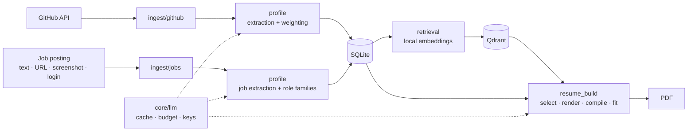

# Open to Work

A self-hosted job search workspace. It builds a skill profile from GitHub activity and manually entered experience, tracks job postings, and generates tailored LaTeX resumes grounded in that profile.

Each skill links back to the evidence behind it: a dependency manifest, a README, a repository description, or a role. Generated resume content is restricted to projects and skills from that evidence.

## Features

### Profile

- **GitHub sync** from a username, profile URL, or single repository URL. Progress streams to the browser over Server-Sent Events and can be cancelled. When GitHub rate limits a batch partway through, the repositories already fetched are kept and the sync reports how many were saved. READMEs, manifests, and commit stats are refetched only for repositories pushed since the last sync.
- **Skill extraction** per repository. Dependencies come from manifests for Python, JavaScript, Go, Rust, Ruby, and JVM (Maven/Gradle) projects with no LLM involved. One LLM call reads the README, or the repository description if there is no README, and repositories with neither make no LLM call.
- **Evidence weighting** by source type, fork status, commit recency, and commit volume. Evidence for the same skill across repositories is combined with a noisy-OR.
- **Per-repository status** (pending, extracted, failed, rate limited, no signal) with manual reprocessing. A provider rate limit or budget cap stops the batch. The next run continues from there without repeating completed repositories.
- **Skill map**: every skill placed on one plane, with related skills near each other and groups named after their most central member. Each name is embedded together with the evidence around it, so placement follows what a skill was used with rather than how it is spelled. The layout is cached and rebuilt only when the skills change.
- **Manual portfolio data**: projects, work experience as individual bullet points, education, skills, contact details, social links, and starred projects and skills.
- **Resume library**: upload PDF or image resumes. Tags, target roles, a summary, and work history are extracted, then merged into the profile without duplicating existing skills or roles.

### Jobs

- **Four ways to add a posting**: paste text, fetch a public URL, upload a screenshot, or fetch a login-protected page through a stored browser login profile (Playwright).
- **Structured extraction** of salary range, employment type, seniority, required experience, and required skills with expected proficiency.
- **Role families**: titles such as "ML Engineer" and "Machine Learning Engineer" are grouped by embedding similarity. An LLM call is made only when a title has no close existing match.
- **Application tracking** with applied date and notes, a skill gap view for each posting, and skill-demand analytics across all collected postings.

### Resume generation

- For a selected posting, semantic search retrieves candidate projects, skills, and experience bullets. One LLM call then picks from those candidates and writes the summary and project bullets. Any project or skill the model returns that was not a candidate is discarded.
- Work history and education are always included in full and are never sent to the model for editing.
- Output is rendered to LaTeX from one-page or two-page templates and compiled with Tectonic. If the PDF is longer than the page limit, a multimodal pass reads the rendered PDF and removes one item at a time, in a fixed order (a skill first, then a project bullet, then an experience bullet), until the resume fits.
- Generated resumes are saved to the library and can be revised later with a plain-language instruction.

### Operations

- Multiple local profiles on one machine, with no login.
- LLM provider keys are entered in the app and encrypted at rest. Supported providers are Gemini (the default), OpenAI, Anthropic, Mistral, Azure OpenAI, AWS Bedrock, and Ollama. Keys can be disabled, limited to specific profiles, or given their own monthly budget. The model for each tier and the overall monthly budget are picked on the same page.
- Keys for the same provider back each other up. A key that runs out of quota or gets rejected halfway through a long job is set aside and the next key takes over the same request, so the job carries on from where it was instead of starting over. The job only stops once every key is spent, and it then says which step it stopped at, what had already finished, and what happened to each key. Work already done is kept, so running it again continues rather than repeats.
- Every LLM call goes through a single client. The client caches responses by content hash, checks the monthly budget before sending a request, and records cost, tokens, latency, and which feature spent the call. The usage page breaks spend down by feature, so it is clear what the month went on.
- A monitor page shows GitHub rate-limit headroom, LLM spend broken down by provider, key, profile, tier, and model, and a log of rate-limit events.
- The SQLite database is snapshotted to `data/backups/` on every startup, and the 10 most recent snapshots are kept.

## Architecture



Module responsibilities, the data model, and project conventions are in [docs/ARCHITECTURE.md](docs/ARCHITECTURE.md).

## Tech stack

Python 3.12, FastAPI, SQLAlchemy with SQLite, Qdrant, sentence-transformers (`BAAI/bge-base-en-v1.5`, run locally), LiteLLM, Jinja2 with Tailwind CSS and Alpine.js, Tectonic, Playwright, pypdf, rank-bm25, pytest, ruff, and mypy. Runs with Docker Compose.

## Getting started

Requires Docker with Compose. The app is meant to run locally on your own machine.

```bash
git clone <repository-url> open-to-work
cd open-to-work
make start
```

`make start` installs Docker on Linux if it is missing, builds and starts the containers, waits for the health check, and opens the browser. The app uses port 8000 and Qdrant uses port 6333. If either port is taken, the next free port is used and the script prints the address. `docker compose up --build` also works, but only on the default ports.

Create a profile, paste a Gemini API key when prompted, and sync a GitHub account. Gemini keys are free to create at [Google AI Studio](https://aistudio.google.com/apikey).

### Configuration

There is nothing to configure before the first run. Settings are made in the app and stored in the local SQLite database.

On the **Manage APIs** page (`/apis`):

| Setting | Default | Purpose |
| --- | --- | --- |
| Provider keys | none | Encrypted at rest. Any number of keys per provider, used as failover for each other. A key that runs out of quota is rechecked by itself once its limit has had time to reset; a key the provider blocked waits for you to fix it. |
| Bulk model | `gemini/gemini-flash-lite-latest` | Per-repository extraction, role-family naming, and groundedness checks. |
| Quality model | `gemini/gemini-flash-latest` | Resume generation, page-fit cuts, and job and resume extraction. |
| Monthly budget | $20 | Cap across all LLM calls, checked before each request. |

Gemini is the default because its keys are free and quick to get. The `-latest` aliases follow Google's current Flash models, so the defaults keep working after older versions are retired. To use another provider, add its key and pick its models on the same page. The model field suggests models from LiteLLM's catalog and accepts any LiteLLM model name, such as `ollama/llama3.1`.

The only file-based setting is optional: `GITHUB_TOKEN` in `.env`, which raises the GitHub API limit from 60 to 5,000 requests per hour. `make start` creates `.env` from `.env.example` on the first run. Nothing else is read from `.env`.

Everything else is fixed in code: the local embedding model (`BAAI/bge-base-en-v1.5`), the database location, and the upload folders. All application data (the SQLite database, uploaded files, backups, and the generated key that encrypts stored credentials) lives in `./data`, which is mounted into the container.

## Development

```bash
python3 -m venv .venv
.venv/bin/pip install -e ".[dev]"
docker compose up -d qdrant

make test                              # unit tests; no network or API key required
make coverage                          # unit tests with a line and branch coverage report
make lint                              # ruff and mypy
make test-live                         # opt-in checks against real services, see Testing
make ingest ACCOUNT=<github-username>  # sync from the command line
make eval ACCOUNT=<account-id>         # retrieval and groundedness evaluation
```

### Testing

Tests are written with pytest and live in two suites.

`tests/unit/` runs on every `make test`. It covers each layer on its own: the GitHub client and sync pipeline, job and resume ingestion, skill extraction and weighting, retrieval, the LLM gateway (caching, budgets, key rotation), credential encryption, resume building, the evaluation metrics, and the command-line entry points. Every API router is exercised through FastAPI's test client, and a route sweep renders every page and calls every list endpoint, so a broken template or a failing route is caught even without a dedicated test. Unit tests use temporary SQLite databases, in-memory Qdrant, and injected fakes for GitHub, the LLM, the embedding model, Tectonic, and Playwright. `make coverage` adds a line and branch coverage report and fails below the threshold set in `pyproject.toml`. Compiling PDFs outside Docker requires a local Tectonic install.

`tests/live/` talks to real services and never runs by default. `make test-live` runs every live suite that has its variable set and skips the rest:

| Variable | Suite | Checks |
| --- | --- | --- |
| `LIVE_LLM_API_KEY` (and optionally `LIVE_LLM_PROVIDER`, default `gemini`, with `LIVE_LLM_BULK_MODEL` and `LIVE_LLM_QUALITY_MODEL` for other providers) | `test_llm_live.py` | Text, image, PDF, and multi-turn calls through the LLM gateway. Billed. |
| `LIVE_GITHUB=1` (and optionally `GITHUB_TOKEN`) | `test_github_live.py` | GitHub API reachability, authentication, 404 handling, and a single-repository sync into a temporary database. |
| `LIVE_APP_URL` (for example `http://localhost:8000`) | `test_app_live.py` | Health, every page, JSON endpoints, and the app's own GitHub status check against a running instance. Read-only. |

### Evaluation

`make eval` scores retrieval against a hand-labeled golden set:

- Dense retrieval against a BM25 keyword baseline (precision@5 and recall@10)
- Context precision over the top 10 results
- Groundedness of generated resume bullets, judged by an LLM

Build the golden set with `python -m scripts.label_golden_set --account <id>`, which runs real searches against your data and records which results are relevant. Reports are written as JSON to `evals/results/`. Pass `NO_GROUNDEDNESS=1` to skip LLM calls.

## Project layout

```
app/
  api/            FastAPI routers and page routes
  core/           settings, models, LLM client, embeddings, credential storage
  ingest/github/  GitHub client, sync, manifest parsing, cancellation
  ingest/jobs/    public URL fetch and authenticated browser fetch
  profile/        skill extraction and weighting, resume and job extraction, role families
  retrieval/      Qdrant indexing and search
  resume_build/   resume assembly, LaTeX templates, compilation, exact page fitting
  evals/          golden set, BM25 baseline, metrics, groundedness
  web/templates/  Jinja2 pages
scripts/          golden-set labeling and one-off migrations
tests/unit/       unit tests
tests/live/       opt-in tests against a real LLM provider
evals/            golden set and results
```

## Privacy

All data is stored locally, and embeddings are computed locally. The following text is sent to the configured LLM provider: README and description text, job posting text and screenshots, uploaded resumes, and the selected profile content used to generate a resume. Job posting text is always sent as a separate user message and is never inserted into a system prompt.

## Limitations

- Skill evidence comes from manifests, README and description text, commit statistics, and manual entries. Source files are not scanned for imports.
- Job postings are added one at a time; there is no bulk job-board crawler.
- Authenticated fetching relies on CSS selectors supplied by the user and cannot get past CAPTCHA or two-factor authentication. Automated logins may violate a site's terms of service.
- The golden set is empty in a fresh checkout, so evaluation results are only meaningful after labeling pairs against your own data.
- Editing a skill or a job posting title does not re-index it. Reprocessing the parent project, experience, or posting re-indexes it.
- Automatic resume extraction supports PDF and image files only.
- Icon glyphs in compiled PDFs do not copy as readable text.
