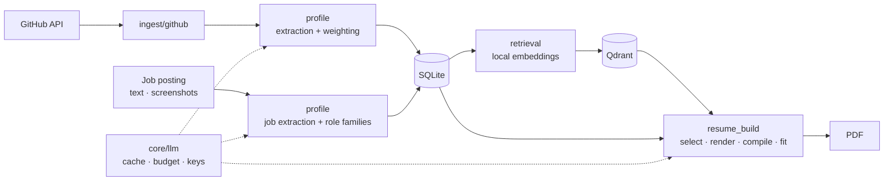

# Open to Work

[](https://github.com/ShailKPatel/Open-to-work/actions/workflows/ci.yml)
[](LICENSE)

Open to Work turns your GitHub into resumes built for each job. Every skill on the page is backed by real work: a dependency file, a README, a role you held. It runs on your own machine.

## Why

A resume should prove what it claims. Here the model picks from your evidence and writes around it. It cannot add a project or skill you do not have. Anything it returns outside the candidate list is thrown out.

## What it does

**Profile**

- Syncs any GitHub user or repository.
- Reads skills straight from dependency manifests (Python, JavaScript, Go, Rust, Ruby, JVM). No LLM.
- Weights evidence by recency, volume, and fork status.
- Draws a skill map from embeddings.
- Imports your existing resume from a PDF or image.

**Jobs**

- Add a posting by pasting text or dropping in screenshots.
- Pulls out salary, seniority, and required skills.
- Groups similar titles into role families.
- Shows your skill gap for each posting and skill demand across all of them.

**Resumes**

- Tailors to one posting with semantic search.
- Builds LaTeX, one page or two.
- Fits the page: tightens the layout first, then cuts one item at a time.
- Revises from a plain instruction.
- Keeps every version in a library.

## Quick start

You need Docker with Compose v2.1 or newer. Nothing else.

```bash
git clone https://github.com/ShailKPatel/Open-to-work.git open-to-work
cd open-to-work
make start
```

Then create a profile, paste an LLM API key (free Gemini keys at [Google AI Studio](https://aistudio.google.com/apikey)), sync a GitHub account, and pick a posting.

- **Linux:** `make start` installs Docker if it is missing on Ubuntu, Debian, Fedora, CentOS, and RHEL. On other distros, install Docker first.
- **macOS:** install and open [Docker Desktop](https://www.docker.com/products/docker-desktop/).
- **Windows:** install [Docker Desktop](https://www.docker.com/products/docker-desktop/), then double-click `start.cmd`. It uses port 8000. From a WSL terminal, the commands above work and pick a free port.

No `make`? Run `./start.sh`. If Docker is missing on macOS or Windows, the script opens the install page.

`make start` builds the app and Qdrant containers, waits for the health check, and opens your browser. The app takes port 8000, or the next free port. Qdrant is reachable only from the app container.

## How it works



### Skill extraction

- Dependencies come straight from manifests. No model.
- One LLM call reads each README, or the repo description when there is no README. Repos with neither are skipped.
- Evidence is weighted by source, fork status, commit recency, and commit volume. Relevance to the job picks the skills and projects. Weight sets their order and breaks near-ties.
- A sync refetches only repos pushed since the last one. A rate limit midway keeps everything fetched so far.

### Resume generation

1. Hybrid search finds candidate projects, skills, and experience bullets for the posting: one query for the role and one per required skill, each run as both embedding search and keyword (BM25) search, merged by reciprocal rank fusion. It searches with the posting's extracted title, summary, and skills rather than the raw text.
2. One LLM call picks from those candidates and writes the summary and project bullets.
3. Anything not on the candidate list is dropped. Work history and education come straight from your profile.
4. A Jinja2 LaTeX template renders the result and Tectonic compiles it.
5. If the PDF runs long, a multimodal model reads it and cuts one item at a time (a skill, then a project bullet, then an experience bullet) until it fits.

### LLM gateway

Every model call goes through one client. It caches responses by content hash, checks the monthly budget before sending, and records cost, tokens, latency, and the feature that made the call. When a key runs out, the next key for the same provider takes over and the job keeps going.

## Tech stack

| Layer | Tools |
| --- | --- |
| Backend | Python 3.12, FastAPI, SQLAlchemy, SQLite |
| Retrieval | Qdrant, bge-base-en-v1.5 (local embeddings), rank-bm25 |
| LLM | LiteLLM with Gemini, OpenAI, Anthropic, Mistral, Ollama, Azure OpenAI, AWS Bedrock |
| Frontend | Jinja2, Tailwind CSS, Alpine.js |
| Documents | Tectonic (LaTeX), pypdf |
| Quality | pytest, Ruff, mypy, GitHub Actions |
| Runtime | Docker Compose |

## Configuration

Settings live in the app. Open **Manage APIs** (`/apis`).

| Setting | Default | Purpose |
| --- | --- | --- |
| Provider keys | none | Encrypted at rest. Extra keys for a provider act as failover. |
| Bulk model | `gemini/gemini-flash-lite-latest` | Per-repo extraction, role families, groundedness checks |
| Quality model | `gemini/gemini-flash-latest` | Resume generation, page fitting, job and resume extraction |
| Monthly budget | `$20` | Hard cap across all LLM calls |

Any [LiteLLM model name](https://docs.litellm.ai/docs/providers) works, for example `ollama/llama3.1`.

One setting lives in a file, and it is optional: `GITHUB_TOKEN` in `.env` raises the GitHub API limit from 60 to 5,000 requests per hour.

All data lives in `./data`: the SQLite database, uploads, backups, and the encryption key. Each startup snapshots the database and keeps the last 10.

## Privacy

Your data and embeddings stay on your machine. Your LLM provider sees only README and description text, job posting text and screenshots, uploaded resumes, and the profile content used to build a resume. The pages load nothing from a CDN except Google Fonts. Tailwind is compiled and the JS libraries are pinned, checksum-verified and served by the app.

## Development

```bash
python3 -m venv .venv
.venv/bin/pip install -e ".[dev]"
docker compose -f docker-compose.yml -f docker-compose.dev.yml up -d qdrant
```

| Command | What it does |
| --- | --- |
| `make test` | Unit tests. No network or API key needed. |
| `make coverage` | Unit tests with line and branch coverage. Fails under 90%. |
| `make lint` | Ruff and mypy |
| `make test-live` | Checks against real services |
| `make ingest ACCOUNT=<user>` | GitHub sync from the command line |
| `make eval ACCOUNT=<id>` | Retrieval and groundedness evaluation |

### Testing

`tests/unit/` tests each layer on its own, with temporary SQLite databases, in-memory Qdrant, and fakes for GitHub, the LLM, embeddings, and Tectonic.

`tests/live/` hits real services. Each suite runs only when its variable is set:

| Variable | Checks |
| --- | --- |
| `LIVE_LLM_API_KEY` | Text, image, PDF, and multi-turn calls through the gateway (billed) |
| `LIVE_GITHUB=1` | API reachability, auth, 404 handling, single-repo sync |
| `LIVE_APP_URL` | Health, every page, and JSON endpoints on a running instance |

### Evaluation

The app has no users or production traffic to learn from, so it is evaluated on purpose-built sets. None contains anyone's real profile.

**Method.** Every set is split into dev and test by a hash of each posting (`app/evals/splits.py`). Prompts, rules and search design are changed while looking at dev only, and only test is reported. Labels are frozen before a system is first run on them. Once something changes after a test result has been read, that test set counts as dev, and a fresh sample is drawn. Accuracy figures carry 95% Wilson intervals and retrieval figures bootstrap intervals, so a perfect score on a small set reads as a range, not 1.00.

| Set | What is in it | Labels |
| --- | --- | --- |
| Public (`evals/public/`) | 260 postings from the [LinkedIn Job Postings 2023-2024](https://www.kaggle.com/datasets/arshkon/linkedin-job-postings) dataset (CC BY-SA 4.0), sampled deterministically | Extraction: the posters' own LinkedIn form fields. Retrieval: judged against written criteria, before any run |
| Real-text (`evals/real/`) | 28 postings from 14 employers' job boards, 21 pinned open-source repositories as one portfolio | Hand-labeled; dev only |
| Generated bullets (`evals/judge/`) | 126 project bullets the app's own resume writer produced for 47 resumes, plus 40 copies each given one unsupported claim | Hand-labeled before the judge ran |
| Synthetic (`evals/synthetic/`) | 10 invented profiles, 29 postings, prompt injection postings | Rule-labeled; regression signal only |

[`evals/public/DATA_SOURCES.md`](evals/public/DATA_SOURCES.md) and [`evals/real/DATA_SOURCES.md`](evals/real/DATA_SOURCES.md) cover sources, privacy and limits. Posting and README text is downloaded on first run and never committed.

**Retrieval, held-out** (60 LinkedIn software postings never tuned on; queries are the app's own LLM extraction of each posting; [report](evals/results/public-fresh-20261009T020614Z.md)):

| System | precision@5 | nDCG@10 | MRR |
| --- | --- | --- | --- |
| Hybrid search (what the app runs) | **0.684** [0.60, 0.77] | **0.777** [0.71, 0.84] | **0.868** [0.79, 0.94] |
| Embedding search alone (the hybrid's dense run) | 0.580 [0.50, 0.66] | 0.683 [0.60, 0.76] | 0.827 [0.74, 0.91] |
| BM25 keyword baseline | 0.536 [0.47, 0.61] | 0.631 [0.56, 0.70] | 0.733 [0.64, 0.83] |
| Single-query embedding search (original) | 0.172 [0.12, 0.24] | 0.234 [0.17, 0.31] | 0.414 [0.30, 0.54] |

Paired over the same queries, hybrid beats BM25 by +0.148 precision@5 [+0.092, +0.208] and +0.145 nDCG@10 [+0.097, +0.194]. Some postings have fewer than five relevant evidence rows, so the best achievable precision@5 on this sample is 0.852, not 1.0.

**Retrieval, larger held-out sample** (150 more LinkedIn software postings, 137 scored; labels by an LLM annotator validated against the hand labels first, kappa 0.849; [report](evals/results/public-fresh2-20261010T054111Z.md), [protocol](docs/RETRIEVAL_IMPROVEMENTS.md)): hybrid precision@5 **0.724** [0.68, 0.77] against BM25 0.559, paired difference +0.165 [+0.127, +0.204]; embedding search alone 0.672, up from 0.279 for the original single-query search.

**Retrieval, external labels** (140 StackOverflow postings from [SkillSpan](https://aclanthology.org/2022.naacl-main.366), CC BY 4.0, 128 scored; a skill counts when the dataset's own annotators marked it in the posting, so only named skills count and the best possible precision@5 is 0.805; [report](evals/results/skillspan-20261010T055057Z.md)): hybrid 0.634 [0.59, 0.68] against BM25 0.487, paired difference +0.147 [+0.103, +0.191]. These use the corrected label rule, which also reads the parts of compound spans such as "core-java/spring/spring-boot"; the first rule, run once before the correction, gave 0.547 against 0.426 ([docs/RETRIEVAL_IMPROVEMENTS.md](docs/RETRIEVAL_IMPROVEMENTS.md) entry 6).

The first test set is why this is the second one. The search was designed on the real-text set, where it beat BM25 by 0.15. On the first 58 held-out LinkedIn postings it lost to BM25, 0.519 against 0.642 ([report](evals/results/public-test-20261009T010921Z.md)). Diagnosed on dev: the real-text queries had been built from the same hand labels that defined relevance, and real extracted queries name many skills an account lacks, for each of which a dense sub-query still ranked every document. Skill sub-queries now run keyword search only (`scripts/compare_retrieval.py`: better or equal on every dev set), and the change was scored once, on the fresh sample (0.624). The embedding run was then changed from one vector per posting to one per named skill, scoring each document by its best similarity: embedding search alone went from 0.172 to 0.580, and the hybrid from 0.624 to 0.684, both designed on dev and scored once ([docs/RETRIEVAL_IMPROVEMENTS.md](docs/RETRIEVAL_IMPROVEMENTS.md)). An oracle run on dev then showed the retriever within 0.01 of the ceiling when given the right skills, so later work targets the query and the share of relevant skills in the 25 handed to the model (0.825 to 0.894 on dev; held-out pending). Cross-encoder rerankers and richer indexed text were measured on dev and made results worse, so neither ships; six embedding models landed within about 0.05 of each other ([results](evals/results/embedding-retrieval-20261008.md)).

**LLM steps, held-out** (test split, gemini-flash-lite; [extraction](evals/results/llm-20261009T013454Z.md), [judge](evals/results/llm-20261009T010730Z.md)):

| Eval | Result | 95% CI | n |
| --- | --- | --- | --- |
| Job extraction: company / title / location | 0.986 / 0.972 / 0.972 | [0.93, 1.00] | 141 postings |
| Job extraction: salary, including not inventing one | 0.988 | [0.94, 1.00] | 85 |
| Job extraction: employment type stated in the text | 1.000 | [0.91, 1.00] | 37 |
| Job extraction: remote | 0.812 | [0.57, 0.93] | 16 |
| Unsupported claims in bullets the app writes | 3 of 80 | [0.01, 0.10] | 80 bullets |
| Groundedness judge agreement with hand labels | 0.975, kappa 0.95 | [0.93, 0.99] | 120 bullets |
| Unsupported claims the judge catches | 40 of 43 | | 43 |
| Unsupported claims the deterministic filter drops | 8 of 43 | [0.10, 0.33] | 43 |
| Grounded bullets the filter wrongly drops | 0 of 77 | [0.00, 0.05] | 77 |

The writer is conservative: its natural error rate is too low to measure the judge's recall, so 40 of its test bullets were each given one unsupported claim (invented numbers, swapped tools, scope, role, outcome and credential claims) and frozen before the judge saw them. The rule filter catches what a string match can see (numbers, technology names) and never drops an honest bullet; the judge catches the rest, missing one role claim and two cases labeled borderline. Extraction errors that remain are real ones, such as reading only the lower end of a pay range.

**Dev sets** (tuned against; regression signal, not claims): real-text retrieval precision@5 0.815 [0.72, 0.90] against BM25 0.654; synthetic retrieval ties BM25, which that set's keyword labels favour; resume extraction on 10 synthetic resumes, judge sets of 45, 30 and 16 hand-written bullets, and prompt injection robustness ([reports](evals/results/)). Two fixes came from them: extraction keeps an employment type only when the posting states it, and the judge treats who the work was for (a team, a company, users) as a claim needing evidence.

**Prompt injection detector** (flags and logs, never blocks; the defence is that posting text only ever reaches the model as a quarantined document):

| Set | Attacks detected | False positives |
| --- | --- | --- |
| Development (rules written alongside) | 11/11 | 0/4 |
| Held-out (written after, never tuned on) | 0/10 | 0/5 |
| Ordinary postings | - | 0/57 |

The held-out rate is the honest one: pattern rules catch the attacks they were written for and miss paraphrases, chat-template tokens, homoglyphs, and other languages.

**Commands**

| Command | Runs | Cost |
| --- | --- | --- |
| `make eval-public SPLIT=fresh2` / `make eval-skillspan` / `make eval-real` / `make eval-synthetic` | Retrieval on each set, in a throwaway database | Free |
| `LIVE_LLM_API_KEY=... make eval-llm [ONLY="public judge-generated"]` | Job and resume extraction field accuracy, the groundedness judge against human labels (accuracy, Cohen's kappa), extraction under prompt injection | About 160 billed calls by default; `public` adds 141, `judge-generated` 120 |
| `.venv/bin/python -m scripts.collect_generated_bullets` | Collects new bullets from the app's resume writer for labeling | One call per resume |
| `make eval ACCOUNT=<id>` | Retrieval and groundedness on your own profile against a golden set you label (`scripts/label_golden_set.py`) | Free without the judge |

Add `WRITE=1` to save a report to `evals/results/`. CI runs retrieval on a separate invented fixture and fails if it drops below `evals/ci_baseline.json`; dependencies are pinned in `constraints.txt` so the gate measures code changes, not package releases.

### Project layout

```
app/
  api/            FastAPI routers and page routes
  core/           settings, models, LLM client, embeddings, credential storage
  ingest/github/  GitHub client, sync, manifest parsing, cancellation
  profile/        skill extraction and weighting, resume and job extraction, injection detection
  retrieval/      Qdrant indexing, hybrid search (embeddings + BM25)
  resume_build/   resume assembly, LaTeX templates, compilation, page fitting
  evals/          metrics, eval sets, groundedness judge, LLM and injection evals
  web/templates/  Jinja2 pages
scripts/          eval runners, retrieval comparison, eval gate, labeling, maintenance
evals/            synthetic and real-text eval sets, CI fixture and baseline, results
tests/            unit and live suites
```

Full design in [docs/ARCHITECTURE.md](docs/ARCHITECTURE.md).

## License

[MIT](LICENSE)
